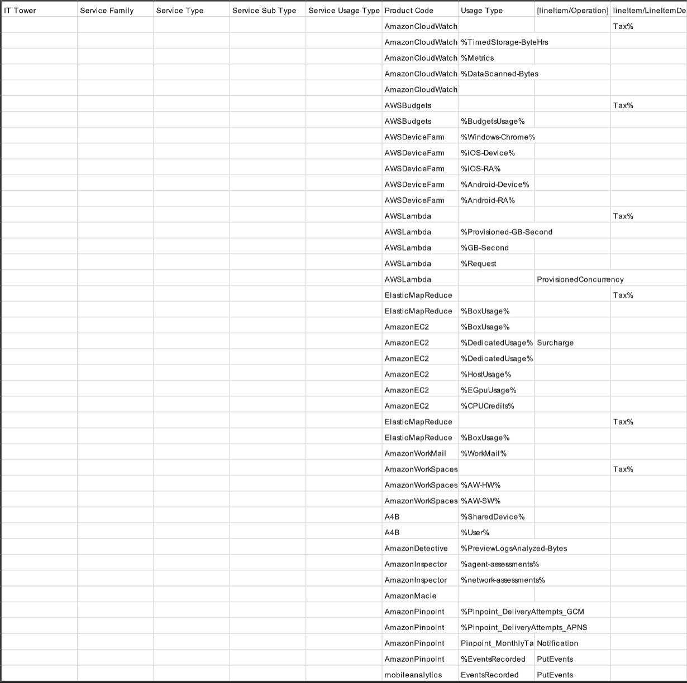
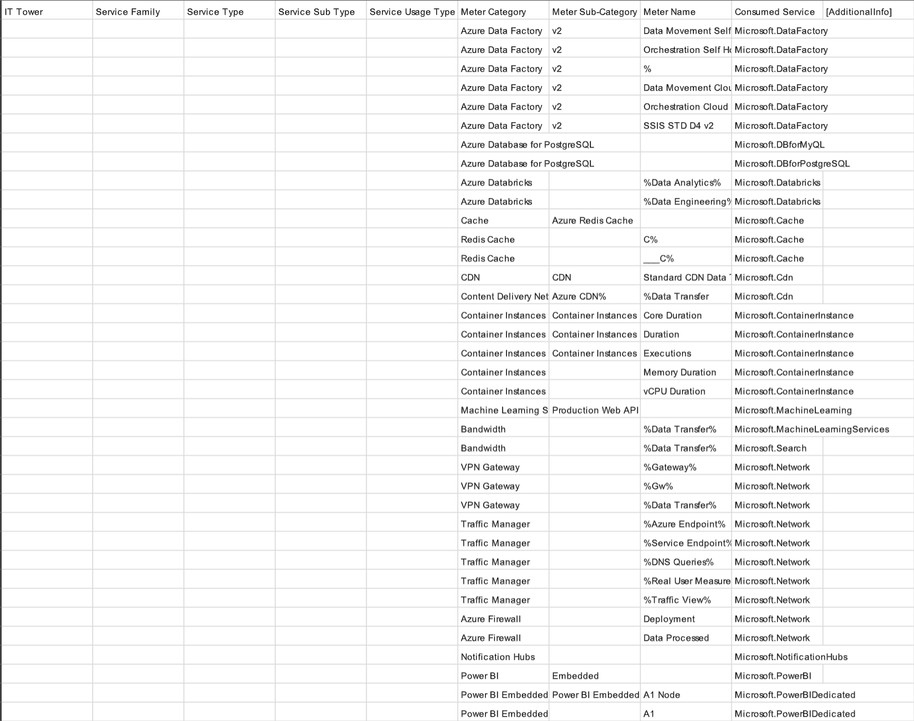
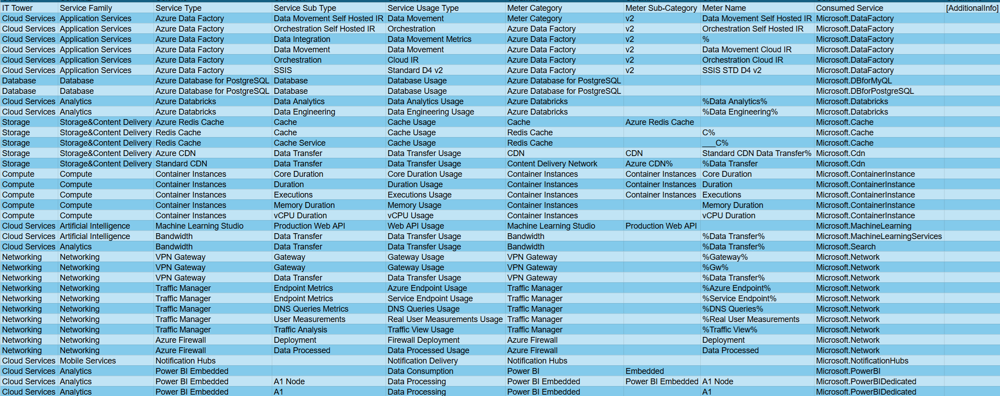

# Отчёт по облачным лабам AWS & AZURE
вариант 4

## AWS
### - [Задание](https://drive.google.com/file/d/15UiEmfObUiIUdpkRDgY3JfX9O5g7sKqJ)
Таблица до

Таблица после

### - [Итоговая Таблица](https://docs.google.com/spreadsheets/d/16oh2iBbuI_KM39E7i5zH2CXW_C801uZ9)
### - [Пояснения](./README_AWS.md/)

---

## AZURE
### - [Задание](https://drive.google.com/file/d/1CsVEu1JZyjqW2AM5m2qiR0M3PU05F6KO)
Таблица до

Таблица после

### - [Итоговая Таблица](https://docs.google.com/spreadsheets/d/1U8jIRBMb_NTJirMw2IWpcwdQzRjXwFoI)
### - [Пояснения](./README_AZURE.md/)

# Вывод
В результате выполнения лабораторной работы я научился доставать информацию из официальной документации облачных сервисов на примере Amazon и Azure. Изучил и понял, как правильно классифицировать сервисы облачных вендоров
