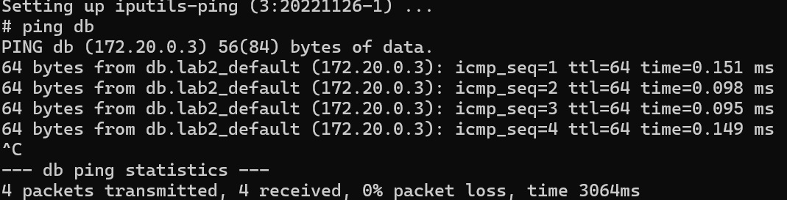
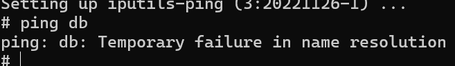

# Second Lab

## Ошибки при написании докерфайлов

## 1: Использование latest
```dockerfile
FROM ubuntu:latest
```
### Почему не надо:
Версии не контролируются, есть шанс, что в новых обновлениях некоторые инструменты будут вырезаны, либо их функциональность изменится
### Как надо
```dockerfile
FROM ubuntu:22.04
```

## 2: Использование apt-get upgrade
```dockerfile
RUN apt-get update && apt-get upgrade
```
### Почему не надо:
Версии должны быть стабильны, ошибка во многом похожа на первую


## 3: apt-get update и install в разных командах
```dockerfile
RUN apt-get update
RUN apt-get install nginx
```

### Почему не надо:
При пересоздании образа, `update` может не выполниться, так как будет закеширован, если изменить строки только после него, например, добавить инструмент в `install`

### Как надо
```dockerfile
RUN apt-get update && apt-get install nginx
```


## 4: Использование ADD вместо COPY
```dockerfile
ADD ./lab/static/index.html /home/app/
```

### Почему не надо:
`ADD` имеет больший функционал чем `COPY`, например при применении к архиву он разархивирует его. Это может быть сюрпризом при ненамеренном применении.
Выбирать команды стоит по ситуации

### Как надо
```dockerfile
COPY ./lab/static/index.html /home/app/
```


## 5 & 6: Копирование директории всего проекта до установки зависимостей и не использование `requirements` файлов
```dockerfile
COPY ./lab/ /home/lab/
RUN pip install pandas
```

### Почему не надо:
Все строки `dockerfile`'a будут выполняться при каждом изменении в проекте, а значит весь образ будет пересобираться 

### Как надо
```dockerfile
RUN apt-get update && apt-get install nginx
```


## 7: Запуск сторонних сервисов во время сборки
```dockerfile
RUN python manage.py migrate
CMD ["python", "manage.py", "runserver", "0.0.0.0:8000"]
```

### Почему не надо:
`RUN` выполняется во время сборки образа, поэтому его не стоит использовать для запуска сторонних программ, например, для миграции БД. Во время запуска контейнера БД может быть недоступна либо может измениться между созданием и запуском


## 8: Использование нескольких FROM
```dockerfile
FROM nginx:alpine
FROM python:3.11
```

### Почему не надо:
В итоговом образе будет сохранен последний `FROM`
### Как надо
Это может быть использовано для сборки образа в несколько этапов, например, для того, чтобы итоговый образ занимал меньше места

```dockerfile
FROM node:3.19 as builder
WORKDIR /lib/
COPY package.json ./
RUN npm install
COPY . .
RUN npm run build

FROM nginx:1.27.1
COPY --from=builder /lib/build/ /usr/share/nginx/html/
EXPOSE 80
CMD ["nginx", "-g", "daemon off;"]
```


## Косяки при работе с хорошими докерфайлами

### 1 Лишние полномочия контейнеров
1) Запуск контейнера с `privileged`.

    Исходя из текста документации, такой контейнер получит доступ почти ко всем возможностям хоста. Можно даже запустить Docker внутри Docker

2) Лишние разрешения для контейнера.
    
    Разрешаем только то, что нужно, что не нужно - запрещаем. Достаточно очевидно
    
    Для управления разрешениями используем `--cap-drop` и `--cap-add`:
    ```cmd
    docker run \
    --cap-drop NET_ADMIN \
    --cap-drop SYS_MODULE \
    --cap-add SYS_TIME \
    -ti lab1 /bin/sh
    ```


### Не забываем про ресурсы


Ограничим доступ к ресурсам с помощью:

1) Максимум памяти, которое может использовать контейнер:
    ```cmd
    --memory 10m
    ```
    (минимум 4 мегабайта)

2)  Максимум файла подкачки:
    ```cmd
    --memory-swap 200m
    ```

3) Ограничение процессора
    ```cmd
    --cpus 2.5
    ```
    Будет использоваться 2.5 мощность ядер процессора


# ⭐

Пусть у нас есть два сервиса, использующих `nginx`, `redis`

`docker-compose.yml`:
```yml
services:
  web:
    image: nginx
    container_name: web
  
  db:
    image: redis
    container_name: db
```
Запустим контейнеры и проверим видят ли контейнеры друг друга в сети
```cmd
docker-compose up -d
```
```cmd
docker exec -it web sh
```
```cmd
apt update && apt install iputils-ping
ping db
```


Создадим на каждый свою сеть - `web` и `db` соответственно

Добавим каждому сервису собственную сеть с драйвером `bridge`, можно было бы указать вместо этого - `none`, но тогда были бы невозможны любые другие сетевые связи:
```yml
web:
  networks:
    - web_network
```
```yml
db:
  networks:
    - db_network
```
```yml
networks:
  web_network:
    driver: bridge
networks:
  db_network:
    driver: bridge
```

Проверим результат `ping`'a на этот раз:



# Заключение
Эта лаба была полезна для меня тем, что я посмотрел на частые ошибки, научился на *чужом* опыте. Узнал несколько новых для себя комманд и флагов к ним. Узнал и научился применять разные сетевые настройки контейнеров