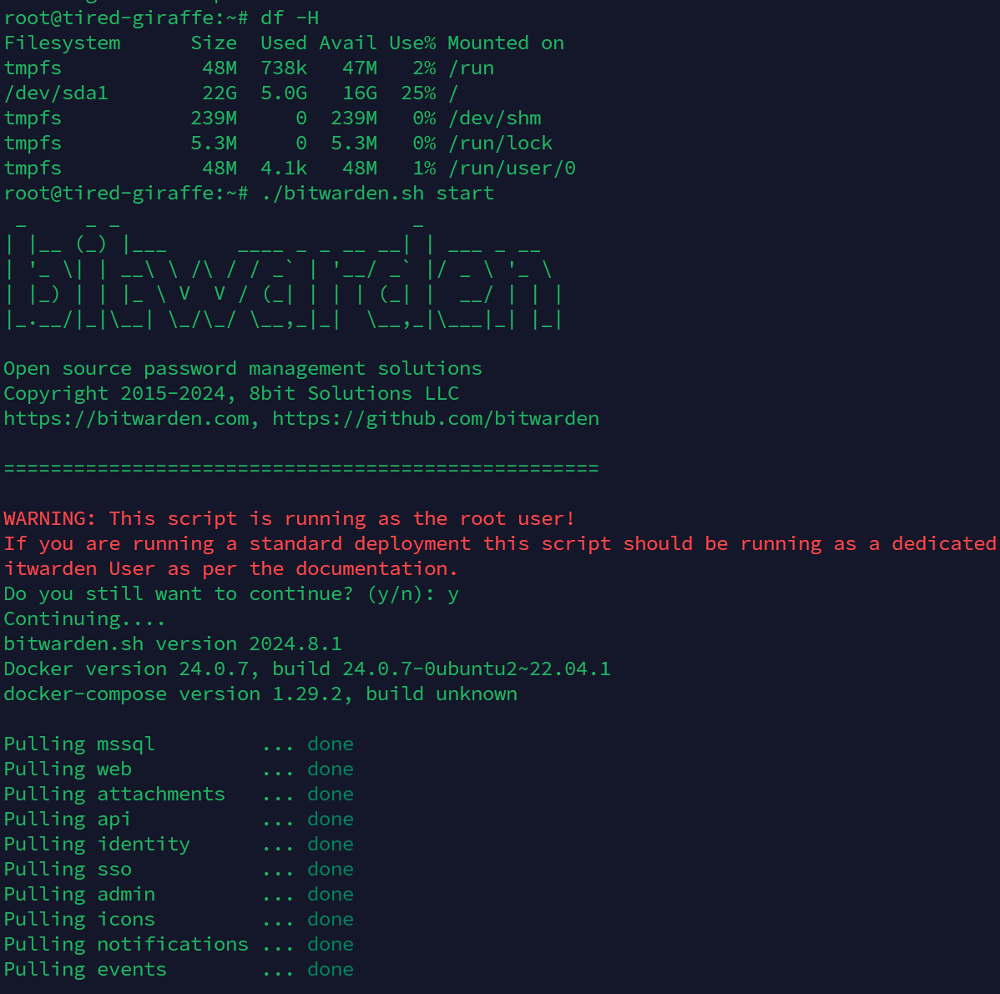

# Third Lab

## Разберем возможные ошибки на примере `workflow` файла `github-actions`

## 1 Отрытое хранение секретов

### Как делать плохо:
```yml
name: Clouds Lab3 Workflow

on: [ commit ]

jobs:
  deploy:
    runs-on: ubuntu-latest
    steps:
      - name: Deploy
        run: ssh user@server "deploy-script.sh"
        env:
          DB_PASSWORD: "secretgiraffe"
```

### Как надо:
```yml
jobs:
  deploy:
    runs-on: ubuntu-latest
    steps:
      - name: Deploy
        run: ssh user@server "deploy-script.sh"
        env:
          DB_PASSWORD: ${{ secrets.DB_PASSWORD }}
```

Так секрет хранится в безопасном хранилище - `Github Secrets`


## 2 Заупск независимых `pipeline`'ов последовательно

### Как делать плохо:
```yml
jobs:
  all_tests:
    runs-on: ubuntu-latest
    steps:
      - name: Unit tests
        run: ./build.sh
      - name: Integration tests
        run: ./integration-tests.sh
```

### Как надо:
```yml
jobs:
  unit_tests:
    runs-on: ubuntu-latest
    steps:
      - name: Unit tests
        run: ./build.sh
  integration_test:
    runs-on: ubuntu-latest
    steps:
      - name: Integration tests
        run: ./integration-tests.sh  
```

Это ускорит работу `CI`


## 3 *Хардкод* ссылок, названий файлов и версий

### Как делать плохо:
```yml
  build:
    runs-on: ubuntu-latest
    steps:
      - name: Install Node.js
        run: curl -sL https://deb.nodesource.com/setup_13.x | sudo -E bash -
      - name: Install dependencies
        run: npm install
```

### Как надо:
```yml
  build:
    runs-on: ubuntu-latest
    steps:
      - name: Install Node.js
        run: curl -sL https://deb.nodesource.com/setup_${{ env.NODE_VERSION }}.x | sudo -E bash -
      - name: Install dependencies
        run: npm install
```

Это позволит сохранять актульные и *одинаковые* версии инструментов во всём проекте

## 4 Пренебрижение кешированием
К предыдущему варианту можно добавить кеширование установки зависимостей

Заменим:
```yml
  build:
    runs-on: ubuntu-latest
    steps:
      - name: Install dependencies
        run: npm install
```

На:
```yml
  build:
    runs-on: ubuntu-latest
    steps:
    - name: Cache node dependencies installation
      uses: actions/cache@v2
      with:
        path: node_modules
        key: ${{ runner.os }}-node-${{ hashFiles('package-lock.json') }}
        restore-keys: |
          ${{ runner.os }}-node-
    - name: Install dependencies
      run: npm install
```

Теперь если установочные пакеты не изменились, будет использована закешированная версия

## 5 Большой нагруженный `pipeline`

### Как делать плохо:
```yml
  huge_pipeline:
    runs-on: ubuntu-latest
    steps:
      - name: Build
        run: ./build.sh
      - name: Unit tests
        run: ./unit-tests.sh
      - name: Integration tests
        run: ./integration-tests.sh
      - name: Deploy
        run: ./deploy.sh
```

### Как надо:
```yml
  build:
    runs-on: ubuntu-latest
    steps:
      - name: Build
        run: ./build.sh

  unit_tests:
    runs-on: ubuntu-latest
    steps:
    - name: Unit tests
      run: ./unit-tests.sh

  integration_tests:
    runs-on: ubuntu-latest
    steps:
      - name: Integration tests
        run: ./integration-tests.sh

  deploy:
    runs-on: ubuntu-latest
    steps:
      - name: Deploy
        run: ./deploy.sh
```

Большой `pipeline` будет долго исполняться, если разбить его на несколько более мелких, иожно будет настроить условия запуска каждого из них, что ускорит процесс `CI/CD`


# ⭐

Напишем `CI/CD` файл, для которого потребуется токен api, например, для `openweathermap`

```yml
name: OWM Project

on: [ push, pull_request ]

jobs:
  build:
  runs-on: ubuntu-latest
  strategy:
    matrix:
      python-version: [ 3.10, 3.11 ]
  
  steps:
    - name: Checkout repository
    - uses: actions/checkout@v2

    - name: Set up Python ${{ matrix.python-version }} 
    - uses: actions/setup-python@v3
    with:
      python-version: ${{ matrix.python-version }}
    
    - name: Install pytest
      run: |
        python -m pip install --upgrade pip
        pip install pytest

    - name: Run unittests
      run: |
        pytest
      env:
        OWM_TOKEN: ${{ secrets.OWM_TOKEN }}
```

Минусом такого подхода является возможность получить токен из логов. Судя по документации `github`'a, до того как попасть в логи токены редактируются, но у злоумышленника всё равно остается возможность помешать этому.
Отрывок из документации:
```
Злоумышленник может получить все украденные секреты или другие данные от средства выполнения тестов. Чтобы предотвратить случайное раскрытие секрета, GitHub Actions автоматически скрывает секреты, напечатанные в журнале, но это не является реальной границей безопасности, так как секреты могут быть намеренно отправлены в журнал. Например, скрытые секреты можно перенести с помощью echo ${SOME_SECRET:0:4}; echo ${SOME_SECRET:4:200};. Кроме того, так как злоумышленник может выполнять произвольные команды, он может использовать HTTP-запросы для отправки секретов или других данных репозитория на внешний сервер.
```

На данный момент Hashicorp Vault доступен в России только в self-hosted версии, помучившись с установкой его на сервер, я решил ископльзовать секретохранилище `bitwarden`. Он шифрует передачу токена, и он становится доступен только на сервере запуска и сервере-хранилище. Для его использования достаточно создать аккаунт на сайте, добавить необходимые секреты и передать `ACCESS-TOKEN` и ссылки на ключи в `yml` файл



Изменим `build-test.yml`:
```yml
name: OWM Project

on: [ push, pull_request ]

jobs:
  build:
  runs-on: ubuntu-latest
  strategy:
    matrix:
      python-version: [ 3.10, 3.11 ]
  
  steps:
    - name: Get Secrets
      uses: bitwarden/sm-action@v2
      with:
        access_token: ${{ secrets.BW_ACCESS_TOKEN }}
        secrets: |
          sad080ds-87as-h3kh-as8d-aeafay72f0ff > OWM_TOKEN

    - name: Checkout repository
    - uses: actions/checkout@v2

    - name: Set up Python ${{ matrix.python-version }} 
    - uses: actions/setup-python@v3
    with:
      python-version: ${{ matrix.python-version }}

    - name: Install pytest
      run: |
        python -m pip install --upgrade pip
        pip install pytest

    - name: Run unittests
      run: |
        pytest
      env:
        OWM_TOKEN: ${{ env.OWM_TOKEN }}
```

Теперь остаётся лишь добавить `ACCESS_TOKEN` в `secrets`. Да его так же могут украть, но при правильной работе с ним (например используя многофакторную аунтификацию) риск скомпромитировать важные ключи становится минимальным. Также благодаря логам `Bitwarden`'a появляется возможность провести расследование кражи токена

# Заключение
Я разобрался с частыми ошибками при работе с `yml` файлами для `CI/CD`, на примере работы с `Github Actions`. Многие из описанных ошибок показались мне неочевидными
