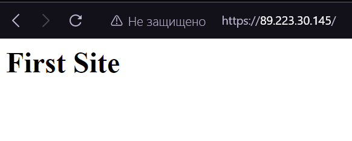
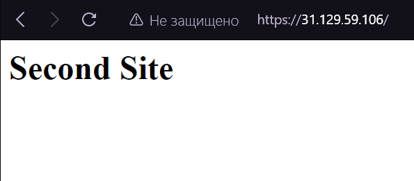

# First Lab
## Инструменты
* Nginx - поднимем сервер по тз
* vscale - поднимем там сервер
* Termius - работа с облачным сервером

# Начало работы
Сначала я долго пытался поднять сайты у себя локально, используя docker-compose и wsl. Но я всегда упирался в одну проблему. Получалось поднять странички, но браузер на винде не видел их, лишь один раз получилось зайти на первый сайт.
Так и не поняв, в чём заключалась проблема совместимости проектов, запущенных в контейнерах, и браузерами, я решил первый раз арендовать облачный сервер.

---
Напишем `nginx.conf`
```python

user www-data;
pid /run/nginx.pid;
worker_processes auto;

events {
    worker_connections 768;
}

http {
    server {
        listen 80;
        server_name 89.223.30.145;
        return 301 https://$host$request_uri;
    }

    server {
        listen 80;
        server_name 31.129.59.106;
        return 301 https://$host$request_uri;
    }

       server {
        listen 443 ssl;
        server_name 89.223.30.145;

        ssl_certificate /root/lab1/certs/firstlab1.com.crt;
        ssl_certificate_key /root/lab1/certs/firstlab1.com.key;

        location / {
            alias /root/lab1/first/;
        }
    }

    server {
        listen 443 ssl;
        server_name 31.129.59.106;

        ssl_certificate /root/lab1/certs/secondlab2.com.crt;
        ssl_certificate_key /root/lab1/certs/secondlab2.com.key;

        location / {
            # proxy_pass https://89.223.30.145;
            alias /root/lab1/second/;
        }
    }   
}
```
Сейчас в виде проектов есть два `hmtl` файла, но если будет необходимость переадресации, то можно расскомитить строки с `proxy_pass`. Например в моём случае, если их расскомитить, то сайт будет перенаправлять пользователя со второй страницы на первую.

Также сгенерируем самоподписные сертификаты с помощью - 
```cmd
sudo openssl req -x509 -nodes -days 365 -newkey rsa:2048 -keyout /etc/ssl/private/SERT_NAME.key -out /etc/ssl/certs/SERT_NAME.crt
```
Установим Nginx на сервер с помощью - 
```cmd
sudo apt update && apt upgrade -y && apt install nginx
```
Закинем наш `nginx.conf` вместо дефолтного в `/etc/nginx/`

Убедимся, что у `nginx user`'a есть доступ к файлам проектов (это место, где изначально у меня возникала ошибка `403`) - 
```cmd
gpasswd -a www-data root

chmod g+x /root && chmod g+x /root/lab1/ && chmod g+x /root/lab1/first
```

И перезапустим `nginx` - 
```cmd
nginx -s reload
```

## Всё должно заработать!


